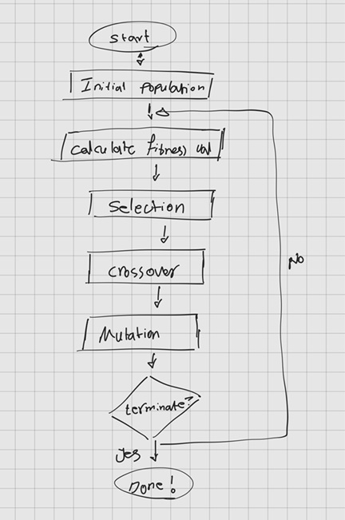

# Genteic Algorithm

Genetic algorithms (I confess that this algorithm is one of my favorite ones) are inspired by Darwinian evolution, which explains how species adapt and improve over time through natural selection. This process allows organisms with advantageous traits to survive and reproduce, passing on their genes to the next generation.
They are particularly interesting because they offer a way to solve complex problems by mimicking the process of natural selection. This algorithm has a facinating history rather than just an optimization algorithm. 

- **Charles Darwin**’s "*On the Origin of Species*" (1859) introduced the idea of natural selection—organisms with beneficial traits survive and pass their genes to the next generation.
Though Darwin didn’t use mathematical models, his ideas laid the foundation for optimization through selection.
- In 1930s, **Ronald Fisher**  applied probability theory to evolution, showing how traits evolve mathematically. His work in population genetics inspired the fitness function in GAs.
- In 1950s, **Alan Turing** in his paper "*Computing Machinery and Intelligence*", Turing speculated about machines that evolve like living organisms. He suggested that a computer could improve itself through mutation and selection, an idea similar to GAs.
- In 1970s, **John Holland** at the University of Michigan introduced the first formal genetic algorithm in his book "*Adaptation in Natural and Artificial Systems*".
He developed a mathematical framework to apply natural selection to optimization problems. Following that year, **Kenneth De Jong**, Hollands student tested GA performance on real-world problems.
- In 1990s, **David Goldberg**, again another student of Holland, used GAs for optimizing pipeline networks. Afterward, he published "Genetic Algorithms in Search, Optimization & Machine Learning" (1989), popularizing GAs in engineering and AI.
- From 2000s till today GA used in robotics, game AI, logistics, finance, Neuroevolution, Quantum GAs and yet no stop to that.
 

The foundation and understanding of a genetic algorithm are not that complicated. At its core, it’s just a trial-and-error search process inspired by evolution.
It is a population-based search method that evolves solutions over multiple generations using mechanisms inspired by biological evolution:
1. Initialization: A population of candidate solutions (chromosomes) is randomly generated.
2. Selection: The best individuals (based on a fitness function) are chosen to pass their traits to the next generation.
3. Crossover (Recombination): Selected individuals swap parts of their genetic code (analogous to reproduction).
4. Mutation: Small random changes are introduced to maintain diversity and prevent premature convergence.
5. Evaluation: The fitness of new individuals is assessed.
6. Repeat: This cycle continues until an optimal or satisfactory solution is found.

